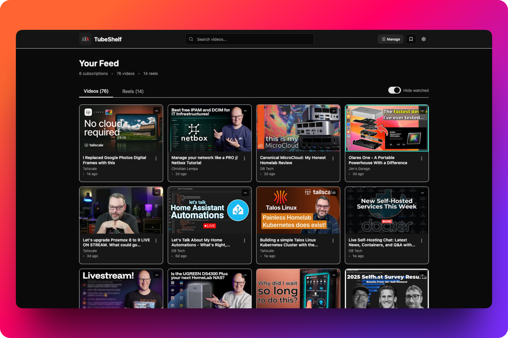

<div align="center">
  <picture>
    <source srcset="public/icon-dark.svg" media="(prefers-color-scheme: dark)">
    <source srcset="public/icon-light.svg" media="(prefers-color-scheme: light)">
    
  </picture>
  <h1>TubeShelf</h1>
  <h3>Self-hosted YouTube subscription feed<br />chronological, distraction-free, yours.</h3>
</div>

<p align="center">
  
</p>

> [!WARNING]
> TubeShelf is in early development and subject to breaking changes. Expect bugs and missing features. Contributions and feedback are welcome!

**TubeShelf** is a self-hosted YouTube subscription experience without a Google account. Browse your subscriptions in a clean, chronological feed - no algorithm, no tracking, just the videos you want in the order they were uploaded.

## Features

- **Chronological feed** - Videos sorted by upload time, no algorithm
- **Multiple subscription lists** - Organize channels with tags and custom lists
- **Watch tracking** - Mark videos as watched, hide unwatched, built-in player with progress tracking
- **Watch later & history** - Save videos for later or review your playback history
- **Import/export** - Full OPML support for easy subscription migration
- **User-Management** - Manage users via OIDC

## Quick Start

### Docker Compose (Recommended)

```yaml
services:
  tubeshelf:
    image: ghcr.io/samumatic/tubeshelf:latest
    container_name: tubeshelf
    restart: unless-stopped
    ports:
      - "3000:3000"
    user: "1000:1000"
    security_opt:
      - no-new-privileges:true
    environment:
      - BETTER_AUTH_SECRET=replace-with-a-random-32+-char-secret
    volumes:
      - ./data:/app/data
```

Start the container:

```bash
# Create data directory with correct permissions
mkdir -p data
chown 1000:1000 data

# Generate a strong BetterAuth secret (use this value in compose.yml)
openssl rand -base64 32

# Start TubeShelf
docker compose up -d
```

Access the web UI at **http://localhost:3000**

### Building a local image

To run your own build instead of the published image:

```bash
# Build tubeshelf:local (and tubeshelf:git-<sha>) from the working tree
npm run docker:build

# Rebuild from scratch / pass any other docker build flag
npm run docker:build -- --no-cache

# Start it
docker compose -f docker-compose.local.yml up -d
```

`docker-compose.local.yml` references `image: tubeshelf:local` and also carries
`build: .`, so `docker compose -f docker-compose.local.yml up -d --build` works
as a one-step alternative to the script.

## Feed cache

Fetched videos are stored in SQLite (`videos` table) and the feed is served from
that cache, so:

- videos stay in the feed after they drop out of the upstream fetch window
  (~15 entries per channel via RSS, ~30 via the standard fetcher)
- a failed or slow refresh shows the last known feed instead of nothing
- page loads are served from the cache while stale channels refresh in the
  background; the refresh button forces an immediate refetch

### Retention

How far back the feed remembers is configurable in the app, not through
environment variables.

- **Per user** — *Settings › Keep Videos For*: 1 month … 2 years, forever, or
  "use instance default".
- **Instance default** — *Admin › System Settings › Feed & Video Cache*: applies
  to every user who has not picked their own window.

Because one cached row serves every user, a video is deleted only when nobody
subscribed to that channel still wants it: the longest window among a channel's
subscribers decides how much is kept, and each user's feed is filtered to their
own window. Channels nobody subscribes to fall back to the instance default.

### Fetch tuning (admin)

*Admin › System Settings › Feed & Video Cache* also controls:

| Setting | Default | Purpose |
| --- | --- | --- |
| Parallel channel fetches | `8` | Channels fetched at the same time |
| Channel timeout | `15s` | Give up on a single channel after this long |
| Request timeout | `60s` | Answer from cache after this long; refresh continues in the background |
| Refresh channels every | `15 min` | Minimum age before a channel is fetched again |
| Retry failed channels after | `5 min` | Shorter retry for channels whose last fetch failed |

### Video durations

Neither RSS nor the standard fetcher reports video length, so durations are
looked up one video at a time in the background and cached permanently. The
first source tried is YouTube's InnerTube player endpoint (cheap, ~14 KB per
video); if `YOUTUBE_INNERTUBE_KEY` is not set, that step is skipped entirely
and every lookup falls straight through to scraping the watch page instead
(works either way, just costs ~1.3 MB per video instead of ~14 KB).

```yaml
environment:
  YOUTUBE_INNERTUBE_KEY: "replace-with-your-own-innertube-key"
```

## CLI Management

Run commands in the container to manage users and settings:

```bash
# List local users
docker exec tubeshelf cli user-list

# Reset local user password (generates a random 16-letter password)
docker exec tubeshelf cli user-reset-password <email>

# Get OIDC-only mode status
docker exec tubeshelf cli oidc-status

# Toggle OIDC-only login mode
docker exec tubeshelf cli oidc-toggle [enable|disable]
```

## Why TubeShelf?

Some Invidious instances do work, though with varying issues. However, they aim to replicate the entire YouTube interface. **TubeShelf** takes a different path: instead of building an alternative YouTube frontend, it focuses on a single, well-defined goal:  
A distraction-free subscription feed without a Google account.

It fetches videos from your subscriptions and displays them chronologically. Click any video to open it on YouTube.

## AI Assistance Disclaimer
This project was developed with assistance from AI/LLMs (including GitHub Copilot, ChatGPT, and related tools), supervised by humans who occasionally knew what they were doing.

---

<sub>TubeShelf is designed primarily for local/home network use.</sub>

## License

This project is licensed under [AGPL-3.0 License](LICENSE).
